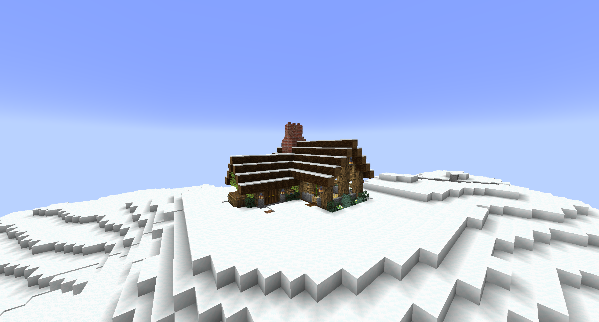
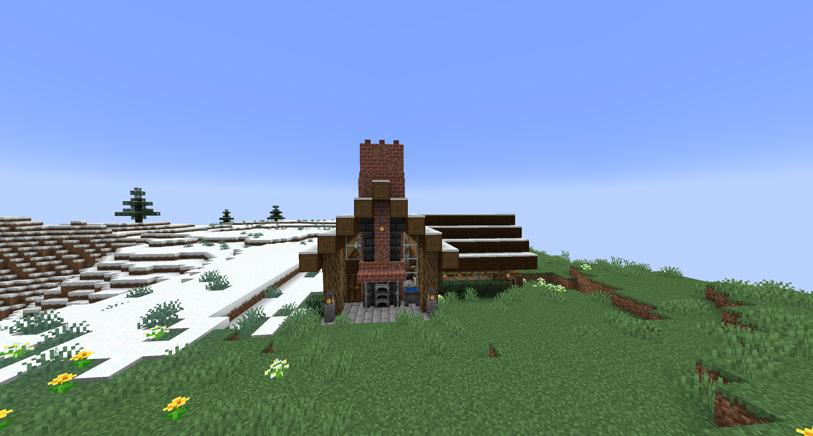

# MinecraftExampleStructure
A 1.18.2 datapack that creates a Mountain Cottage in Mountain Biomes.

Like you would any other Datapack, place a folder or zip file containing the files from this repository into your datapacks folder in your world.  
If you've made it this far, I'll assume you know where that is.

Create a new world with this datapack, load it up and then type /locate example:village_mountains

You can use this as a starting point to add structures into your 1.18.2+ worlds.

If Mojang changes this in the future, this datapack will be updated.

You may use this datapack as a starting point for your own projects, just don't redistribute this exact pack as your own creation :)

Examples:

